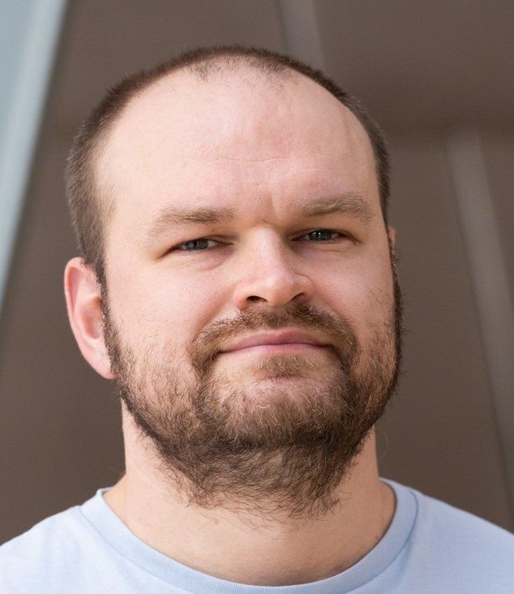

About me
+++++++++

.. _sec-stepan:

Stepan Tsirkin

* `Ikerbasque <https://www.ikerbasque.net/es/stepan-tsirkin>`__ Research Fellow at CFM-MPC.
* PhD in "Physical and Mathematical Sciences" in 2010 from Tomsk State University. (speciality : Condensed Matter Physics)
* Bachelor in "Applied Mathematics and Physics" in 2007 from Omsk State University.
* Father of two sons (who also will join the class)
* Teacher assistant in University of Zurich (2019-2022):
    - Mathematical Analysis
    - Scientific Computing (programming in `Python <https://www.python.org/>`_)
    - Quantum Field Theory

During my School years I participated in Olympiads:
    * Third degree diploma in the Russian National Olympiad in Physics
    * Winner of the Siberian Olympiad in Physics
    * Winner of the Omsk City Olympiad in Mathematics
    * Participant of Kirov Summer School in (1999-2002)
    * Participant of Novosibirsk Summer School in (2001)

